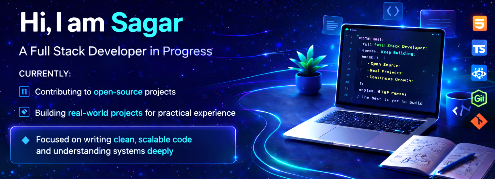

  

 

## About

- I am, a B.Tech CSE student focused on becoming a full stack developer. 
- I build real-world projects to gain practical experience, focusing on strong fundamentals and user-centered solutions.
- I am also interested in contributing to meaningful open source projects.
---

## Tech Stack

---
## Featured Projects

### [FlowSite](https://github.com/itssagarK/flowsite) - Build websites visually, export clean HTML
Design stunning websites in a visual editor and export ready-to-use HTML files:
- Choose from templates for portfolios, projects, business sites, or app landing pages
- Interactive 3D background that makes your site feel modern and alive
- AI can auto-fill your info from a resume or photo
- Switch between light/dark modes and pick your colors instantly
- Export and host anywhere for free (GitHub Pages, Vercel, Netlify)

### [GitHub Helper](https://github.com/itssagarK/githubhelper) - Turn messy notes into professional documentation
Convert rough notes into polished README files, pull requests, and release notes:
- Write naturally, get structured markdown automatically
- Quick access to badges, license templates, and commit emojis
- GitHub Actions templates ready to copy
- Everything works offline on your computer
- No sign-ups, no tracking, completely private

### [NeutralKit](https://github.com/itssagarK/neutralkit) - A System dashboard built for contributers of Neutralinojs

A lightweight dashboard built with Neutralinojs that:

- Visualizes real system data using native APIs  
- Helps track and organize contributions interactively  
- Includes history and recovery features for better usability  

### [ArthaMitra](https://github.com/itssagarK/aarthmitraa) - Arth Mitra is an AI-powered, gamified financial literacy app built for everyday Indians

- Simulates real-life financial decisions (EMIs, expenses, trade-offs)  
- Tracks impact across Savings, Health, Joy, and Relationships  
- Designed for practical financial awareness through interaction  

### [Reality Check AI](https://github.com/itssagarK/Reality-check-2) - A constraint-based planning audit tool that evaluates real-world feasibility

A practical tool designed to analyze whether your plans will actually work based on time, resources, and execution limits:

- Evaluates feasibility with a structured scoring system (0–100)
- Identifies realistic failure points before execution begins
- Analyzes dependencies, risks, and resource gaps
- Suggests actionable alternative approaches
- Defines clear stop signals to prevent wasted effort
---
## GitHub Stats
<table align="center">
<tr>
<td>

</td>
<td>

</td>
</tr>
</table>

---

## Activity

---

## Connect

---

