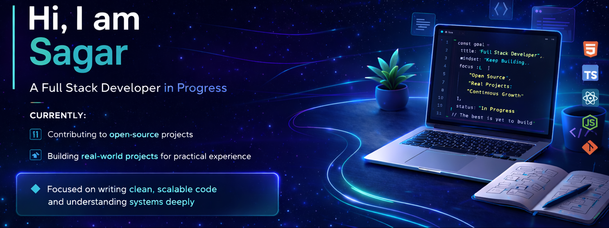

  

 

## About

Hi, I'm Sagar  
- Systems Programming Enthusiast | Open Source Contributor  
- Building cross-platform desktop tools with C++ & Node.js  
- Focused on low-level understanding and real-world codebases
---

## Tech Stack

---

## GitHub Stats

---

## Activity

---

## Connect

---

